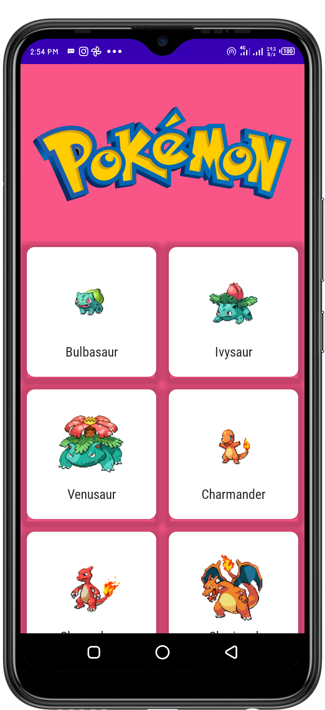

# Pokemon

 A simple one screen application developed with the aim of learning clean architecture design principal.The project make use of [Pokemin Api](https://pokeapi.co/api/v2/pokemon) to display pokemon image and name.
 To learn more on clean architecture follow though [My Article](https://states-in-compose.hashnode.dev/clean-architecture-guide)
  
Min Api Level : 16 

## Setup Requirements

- Android device or emulator
- Android Studio

## Getting Started

In order to get the app running yourself, you need to:

1.  clone this project
2.  Import the project into Android Studio
3.  Connect the android device with USB or just use your emulator
4.  In Android Studio, click on the "Run" button.

## Tech Stack
- [Jetpack Compose](https://developer.android.com/jetpack/compose) - Jetpack Compose is Android’s modern toolkit for building native UI. It simplifies and accelerates UI development on Android. Quickly bring your app to life with less code, powerful tools, and intuitive Kotlin APIs.
- [Kotlin](https://developer.android.com/kotlin) - Kotlin is a programming language that can run on JVM. Google has announced Kotlin as one of its officially supported programming languages in Android Studio; and the Android community is migrating at a pace from Java to Kotlin
- [Kotlin Coroutines](https://kotlinlang.org/docs/coroutines-overview.html) - A concurrency design pattern that you can use on Android to simplify code that executes asynchronously
- [Android KTX](https://developer.android.com/kotlin/ktx)-Android KTX is a set of Kotlin extensions that are included with Android Jetpack and other Android libraries. KTX extensions provide concise, idiomatic Kotlin to Jetpack, Android platform, and other APIs.
- [LifeCycle](https://developer.android.com/jetpack/androidx/releases/lifecycle)-Lifecycle-aware components perform actions in response to a change in the lifecycle status of another component, such as activities and fragments. These components help you produce better-organized, and often lighter-weight code, that is easier to maintain. 
- [ViewModel](https://developer.android.com/topic/libraries/architecture/viewmodel)-he ViewModel class is designed to store and manage UI-related data in a lifecycle conscious way.
- [Retrofit](https://square.github.io/retrofit/) -  Its a simple network library that is used for network transactions. By using this library we can seamlessly capture JSON response from web service/web API.
- [Dependency Injection](https://developer.android.com/training/dependency-injection/hilt-android) - A dependency injection library for Android that reduces the boilerplate of doing manual dependency injection in your project.
- [Coil](https://coil-kt.github.io/coil/compose/) - An image loading library for Android backed by Kotlin Coroutines.
- [Timber](https://github.com/JakeWharton/timber) - A logger with a small, extensible API which provides utility on top of Android's normal Log class.
## Demo

  

  
## Support
- Found this project useful ❤️? Support by clicking the ⭐️ button on the upper right of this page. ✌️
- Notice anything else missing? File an issue 
- Feel free to contribute in any way to the project from typos in docs to code review are all welcome.
